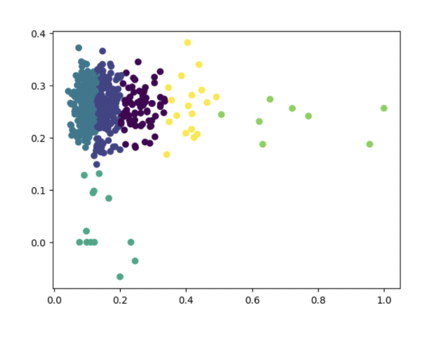
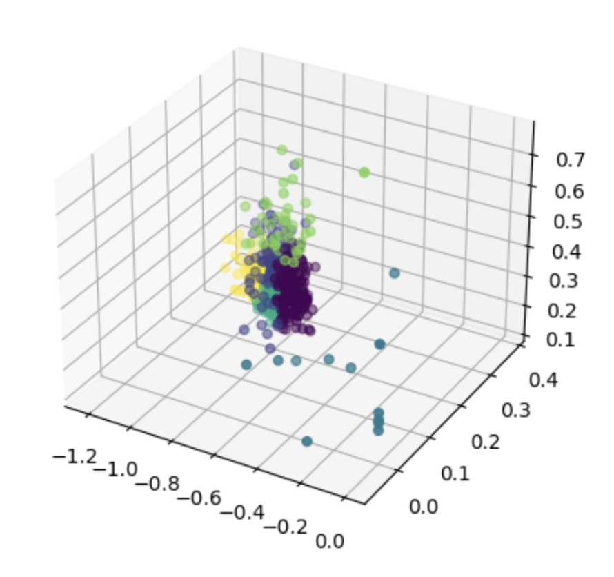

<!-- Text can be **bold**, _italic_, or ~~strikethrough~~. -->

<!-- [Link to another page](./another-page.html). -->

<!-- There should be whitespace between paragraphs.

There should be whitespace between paragraphs. We recommend including a README, or a file with information about your project. -->

# Introduction


In the realm of stock portfolio management, the application of advanced machine learning (ML) techniques for effective diversification is gaining traction. Our project aims to explore and leverage advanced ML models to categorize stock based on both textual description and financial data and give users an objective measure of their portfolio’s diversity. Recent studies have delved into clustering algorithms like Gaussian Mixture Models (GMM) for categorizing stocks. However, the potential of more advanced ML models in combination with clustering algorithms is still in its infancy.

# Problem Definition

The primary motivation is to overcome the shortcomings of conventional portfolio diversification and make a new and objective rating system for a portfolio's diversity. An article by Gilles Koumou investigates the utility of several common diversification practices and clears up several misconceptions, noting that “as the 2007–2009 financial crisis revealed, the concept remains misunderstood” <cite>(Koumou, 2020)</cite>. The project seeks to incorporate a nuanced understanding of stock types, utilizing features such as market capitalization, volatility, and textual information from company descriptions. Evidence-based studies on diversification practices, such as Koumou’s publication, will be considered throughout the duration of our project. The goal is to offer users a personalized and dynamically optimized portfolio aligned with individual preferences and market conditions.

# Data Collection

For this ML project, we were successful in scraping and processing 6 features for 500 companies from the S&P 500. The specific data points are listed below:

1. Ticker/Description of Company (self-explanatory)
2. Volume (number of shares traded)
3. Market Capitalization (Value of the company)
4. Price to Earnings Ratio (Share Price / Earnings per Share)
5. Volatility Score (was found online)

Starting from the top, gathering the data from the description of companies was done through a web scrape for every company from Wikipedia. The main library used was BeautifulSoup and the goal was to fetch the description from each company and append it to a CSV file. The Python script retrieves the ticker symbols and Wikipedia URLs for all S&P 500 constituents and stores the data in a dictionary. Next, with the dictionary, company descriptions are retrieved through a GET request to their respective URLs, parses the company data using BeautifulSoup where it finds all of the Wikipedia summary texts, adds them to another dictionary in the form {ticker, summary text} and exports as a CSV. **Note: we also tried using Alpha Vantage but that proved to be unsuccessful due to a strict rate limit for API calls.**

Secondly, gathering every company’s volume, market capitalization, and price-to-earnings ratio was done in conjunction using command line arguments that pull data from Yahoo Finance. To begin, the script first aims to create a dictionary that follows the pattern of


and makes a GET request for every company. If the request succeeds, it responds with valid JSON data which is then parsed, harvesting only the 3-month average volume relative to outstanding shares, market capitalization, and price-to-earnings ratio. The data is added to the dictionary and eventually converted and stored as a CSV file. For all data collection scripts, network errors and data anomalies are flagged by the script.

### Data Preprocessing

Word2Vec: Because company descriptions are simply a paragraph of text, we used the Word2Vec algorithm in order to capture semantic meaning in order to divide the company into different qualitative variables such as industry. The data is first preprocessed by removing punctuation and stopwords. The transformed data is then trained off of a portion of the data and after applying normalization to the data, the final output is done by converting it into a CSV file which holds vector representations of the different company descriptions. In our case we purposefully did not have a “goal” with Word2Vec in an attempt to capture the nuances of a company's goals and description without biasing its output in what we think makes a company unique. In other words, we did not try and use Word2Vec to capture ideas like industry, but rather to create an undefinable sentiment for the company that we can then compare to other companies. 

Given an appended CSV with the ticker/description, volume, market capitalization, price-to-earnings ratio, and volatility score, the first necessary step was to normalize the data to allow GMMs to accurately work with the data. Starting with the parser, for every feature, a different normalization algorithm is conducted. First of all, when the parser encounters the company description, because there is not really a point to normalize sentences, data is cleaned up by replacing every new line character with a space. Secondly, for the volume we normalized the data by dividing each entry by the maximum in the data set, meaning all values ended up between 0 and 1. Next, for the price-to-earnings ratio, the data is normalized by taking the reciprocal of the entry value. Finally, for market capitalization, we took the log of each company's market cap and divided it by the log of the largest market cap in the data set.

It is important to note that this was not our first attempt at normalizing our data. For example, our original attempt for normalizing the market cap was simply every market cap by the maximum of our dataset, normalizing all values between 0 and 1. However, after visualizing our data and looking at the clusters, we found that because the market cap disparity between the average company and the largest company in our data set was so large the majority of market cap values were very close together. This along with some other issues led to a majority of our companies belonging to one single cluster.

# Methods

**Principal Component Analysis (PCA) for Dimension Reduction:** Our data is 9-dimensional. We plan to increase the number of dimensions for the next stage of the project but it won’t exceed 500 which is the number of our data points. Compared to the 500 data points we have, there is no need to do dimension reduction in terms of computational efficiency and interpretability of the relationships within data. However, for visualization purposes, we found visualizing data with 9 dimensions challenging. To better visualize our results, we decided to do dimension reduction with PCA to project our data into a lower-dimensional space whilst also preserving the most important relationships between the variables observed in the data. We are exploring more ways to visualize 9-dimension data. During the next stage of our project, we may remove the step of dimension reduction if the model performs well with the 9-or-more dimensional data without observing issues like overfitting or poor generalization and we have found a way to visualize our data.

Based on the PCA plot we generated during dimension reduction, it can be observed that the majority of our data share similarities in their feature values and form one big cluster. Still, this is the result improved by re-normalizing data and the original data gave a more compact cluster where most data points are very close to each other. Also, there is no strong indicator of which principal component is making a greater contribution and better represents the importance of original features. This may be the problem of our data, so we are considering adding more features that may be more representative of the relationships between our data points.

{: width="65%" }

**Silhouette Scores for Optimal Number of Clusters:**What it is: Given the number of clusters, the Silhouette score offers insight into providing a qualitative number that addresses the question of how well each data point lies in its respective cluster. The score ranges from -1 to 1 and is based on the relationship between each data point’s distance from every other point in its cluster as well as the distance between points not in the cluster. 

Application of Silhouette score: Given a normalized vector of the data for all 500 companies, we decided that the Gaussian Mixture Model would work best as a way to highlight diverse vs. not diverse portfolios. To find the optimal number of components, we used the built-in GMM function from Sci-kit Learn and created a range of possible clusters from 2-20. We then ran the GMM 18 times for every different possible cluster and calculated the silhouette coefficient for each iteration. The average silhouette score was taken from the bottom 20% (conservative estimate) and then plotted. 

{: width="70%" }

Takeaway: Even though the silhouette scores are lower than we would like for clustering as nearly every estimate hovers around 0, it is important to recall that the numbers taken are conservative estimates in the worst case. Regardless, the important concept is to see that in order to find the optimal amount of clusters, its silhouette score has to be simply relatively higher than other scores. Therefore, from the silhouette score graph, cluster sizes of 4, 5, or 19 seem like viable options and can be further explored by other criteria for solving an optimal number of clusters. 

**Bayesian Information Criterion (BIC) for Optimal Number of Clusters:**What it is: BIC is a statistical criterion used in model selection and model evaluation. It provides a way to compare different models based on their fit to the data while penalizing for model complexity. The BIC score balances the goodness of fit (as measured by the log-likelihood) with the penalty for model complexity (as measured by the number of parameters). When it comes to selecting the optimal number of clusters in a clustering algorithm, BIC can be used by fitting the model for different values of k (number of clusters) and choosing the k that minimizes the BIC score. The optimal number of clusters is one that achieves a good balance between fitting the data well and avoiding excessive complexity.

Instead of simply plotting silhouette coefficients, we had the same base case of iterating through possible clusters from 2-20 but this time calculating the BIC. With the goal of minimizing BIC as it means that it is the optimal number of clusters that fit the model the best, we determined that the optimal number was 5. 

{: width="70%" }

**Bayesian Information Criterion (BIC2) for Optimal Number of Clusters:**BIC2 added further rigorousness to testing for the optimal number of clusters. The code was run 20 times per cluster instead of 1 and the standard deviations and error estimation. 

{: width="70%" }

**Gradient Calculation:**We also calculated the gradient of the BIC2 scores in order to indicate how sensitive the BIC2 scores are if the number of clusters changed. In this case, we are hoping to find an elbow in the graph to indicate the optimal number of clusters where the gradient is highest.

{: width="70%" }

**Running GMM:** We then ran GMM for 4, 5, and 6 clusters due to their high gradient BIC scores as well as low scores overall. We then assign each company to each cluster based on the highest probability, done using a dictionary with the following example {Cluster x: {company 1, company 2, …}} where x is the number representing 1 - 4 for 4 clusters, 1 - 5 for 5 clusters, 1 - 6 for 6 clusters. This was done to ensure that no cluster held too many companies as that was an issue we faced before proper feature selection and normalization. Having decided that 5 clusters was the optimal number for our application we moved on to visualizing and interpreting our results.

### Visualizations

**Combination of Vectors for Silhouette Score:** Our first attempt to visualize our data and clustering was to simply find the most impactful features 2 or 3 features based solely on silhouette score. To find these features we simply clustered the data based on every combination of 2 and 3 features to find which combinations minimize the silhouette score. Using those results we then plotted the data when clustering with those features as seen below. 

{: width="50%" }
{: width="50%" }

**Using PCA:** Our more advanced method for data visualization was to use PCA as described above to reduce the dimensionality of our data into 2 features. The clustering found after using PCA is shown below.

{: width="50%" }


# Results and Discussion

Based on the data, we have determined that the optimal number of clusters is 5 and have created a working diversity calculator for any number of sample portfolios. To test the model, we can test our model against various portfolios (High Diversity vs Low Diversity). The following portfolios are High Diversity portfolios, as they consist of various industries and spread out overall value.


The following portfolios are Low Diversity portfolios, as they consist of generally one industry or heavily invested in one particular stock.


With these portfolios, we calculated a diversity score based on our GMM output for each stock. Firstly, we take the portfolio and calculate the percentage of each stock over the total value of the portfolio. Next, we calculated a diversity vector by adding each corresponding stock vector after multiplying with the percentage makeup. 


With the diversity vector, we calculated the absolute difference for each dimension between our stock with the perfect diversity vector, for which we defined as:

{: width="80%" }


We output the inverse of the summed value as the diversity score.


The high diversity portfolios had an average diversity score of 2.916, while the low diversity portfolios had an average diversity score of 1.067. It is clear that based on our created GMM model, a higher diversity score is equated with a more diverse portfolio. From the result, our model demonstrated valid data that can distinguish between high and low diversity portfolios.

# Looking Ahead

While we are relatively happy with our current implementation there are some features we would like to add, and optimizations we would like to make. First, even after many attempts of feature selection and reduction, we are left with a suboptimal number of clusters and silhouette scores. While our model does accurately distinguish between low and high-diversity portfolios, it is not as nuanced as we would like. In the future, we plan to either get new data or expand our feature set through polynomial variants of our current features. We hope that by increasing the number of features we can pick up more subtle differences between stocks thereby increasing how nuanced our diversity score is. 

The other main goal we have is to implement a stock recommender based on a user's portfolio. As stated earlier our definition of diversity is making the values within the diversity vector as equal as possible. Using this definition we plan to implement an algorithm that will recommend a handful of stocks to the users that when added to their portfolio would increase their diversity score. We are not entirely sure what kind of algorithm to use, but


# Timeline and Contributions

Please go to this [link](https://docs.google.com/spreadsheets/d/14tqgJGyeV8g7UURRkbnhb-IWGrCUOo9_/edit?usp=sharing&ouid=117826216135502018457&rtpof=true&sd=true) to access the proposed timeline and contribution table.


<!-- # References

<cite>
Koumou, G. B. (2020, June 4). Diversification and portfolio theory: a review. Financial Markets and Portfolio Management, 34, 267–312.
</cite>

<cite>
Luxenberg, E., & Boyd, S. (2023). Portfolio construction with gaussian mixture returns and exponential utility via convex optimization. Optimization and Engineering. https://doi.org/10.1007/s11081-023-09814-y
</cite>

<cite>
Wang Y, Grani A. Hanasusanto, Chin Pang Ho. (2022, July 7). Optimization online. Optimization Online. https://optimization-online.org/2022/07/8979/ 
</cite> -->


<!-- ## Header 2

> This is a blockquote following a header.
>
> When something is important enough, you do it even if the odds are not in your favor.

### Header 3

```js
// Javascript code with syntax highlighting.
var fun = function lang(l) {
  dateformat.i18n = require('./lang/' + l)
  return true;
}
```

```ruby
# Ruby code with syntax highlighting
GitHubPages::Dependencies.gems.each do |gem, version|
  s.add_dependency(gem, "= #{version}")
end
```

#### Header 4

*   This is an unordered list following a header.
*   This is an unordered list following a header.
*   This is an unordered list following a header.

##### Header 5

1.  This is an ordered list following a header.
2.  This is an ordered list following a header.
3.  This is an ordered list following a header.

###### Header 6

| head1        | head two          | three |
|:-------------|:------------------|:------|
| ok           | good swedish fish | nice  |
| out of stock | good and plenty   | nice  |
| ok           | good `oreos`      | hmm   |
| ok           | good `zoute` drop | yumm  |

### There's a horizontal rule below this.

* * *

### Here is an unordered list:

*   Item foo
*   Item bar
*   Item baz
*   Item zip

### And an ordered list:

1.  Item one
1.  Item two
1.  Item three
1.  Item four

### And a nested list:

- level 1 item
  - level 2 item
  - level 2 item
    - level 3 item
    - level 3 item
- level 1 item
  - level 2 item
  - level 2 item
  - level 2 item
- level 1 item
  - level 2 item
  - level 2 item
- level 1 item

### Small image


### Large image


### Definition lists can be used with HTML syntax.

<dl>
<dt>Name</dt>
<dd>Godzilla</dd>
<dt>Born</dt>
<dd>1952</dd>
<dt>Birthplace</dt>
<dd>Japan</dd>
<dt>Color</dt>
<dd>Green</dd>
</dl> -->

<!-- ```
Long, single-line code blocks should not wrap. They should horizontally scroll if they are too long. This line should be long enough to demonstrate this.
```

```
The final element.
``` -->
